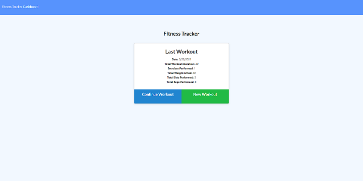
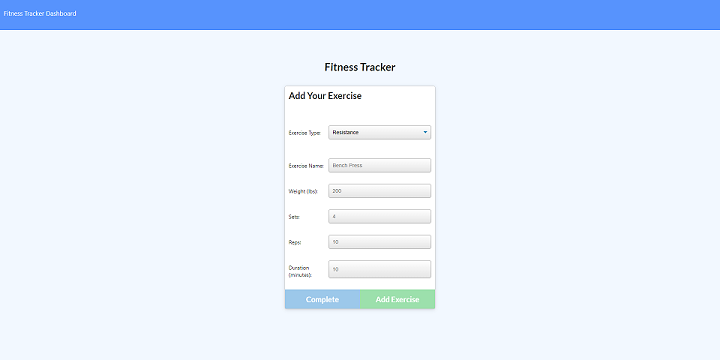
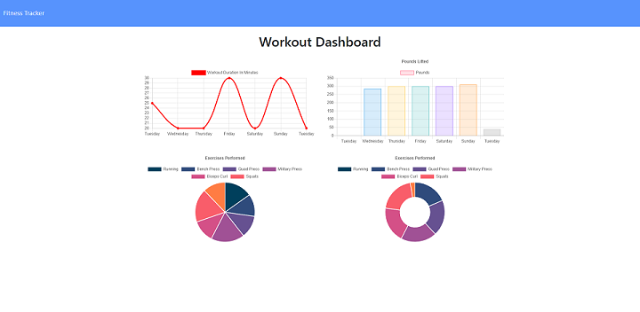

# Workout Tracker

## Description

In this project, I created a workout tracker app where a user will be able to track daily workouts. A user can do the following:

* Create and view a daily workout
* Add multiple exercises to the most recent workout plan
* Add new exercises to a new workout plan
* Track the name, type, weight, sets, reps, and duration of an exercise. If the exercise is a cardio exercise, it will track the distance traveled.
* View the combined weight of multiple exercises from the past seven workouts on a statistics page
* View the total duration of each workout from the past seven workouts on a statistics page

This application uses a Mongo database with a Mongoose schema and handles routes with Express.

## Table of Contents

* [Installation](#installation)
* [Usage](#usage)
* [Screenshots](#screenshots)
* [Website](#website)
* [Code Repository](#repository)
* [License](#license)
* [Contributing](#contributing)
* [Questions](#questions)

## Installation

1. Clone this repo.
2. Install node.js. It can be downloaded here: [node.js Downloads](https://nodejs.org/en/download/)
3. Initialize npm:
    >npm init -y
4. Install npm:
    >npm install
5. Install Express npm package:
    >npm install express
6. Install MongoDB.
7. Create a workout database in MongoDB.
8. Run the /seeders/seed.js file to populate the database.

## Usage

To run this app:

1. Open the console in the directory where the server.js file is located and run the following command:
    >node server
2. Click on _Continue Workout_ to add an exercise to the last workout entered.
3. Click on _New Workout_ to start a new workout plan.
4. Click on the _Dashboard_ link on the upper left corner of the blue navigation bar to see your workout statistics.

## Screenshots

### Index Page

### Add Exercise Page

### Statistics Page

## Website

[Deployed Website](https://workout-tracker-johanna.herokuapp.com/)

## Repository

[Code Repository](https://github.com/johannaleal/workout-tracker)

## License

This application is covered under license: MIT License.

## Contributing

If you would like to contribute to this repository, please contact me via the email below to discuss the changes you wish to make.

## Questions

### Contact Information

GitHub Profile: [@johannaleal](http://github.com/johannaleal)

Email: <johannarleal@gmail.com>
